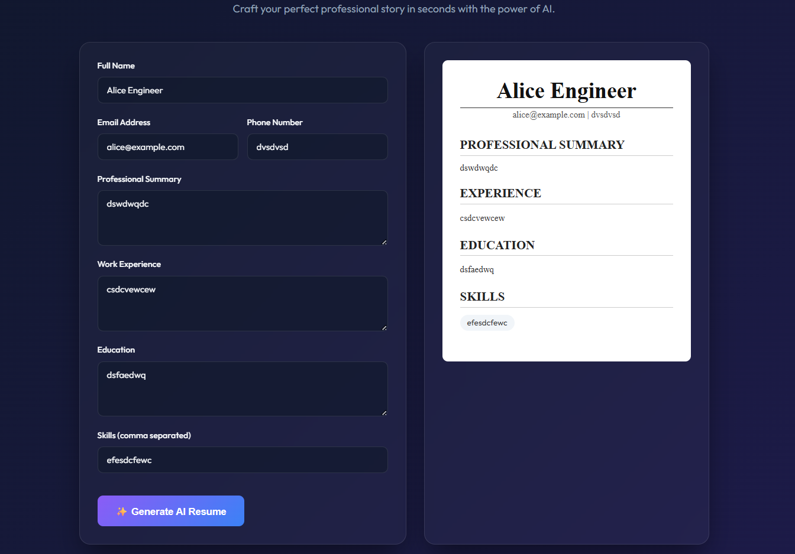
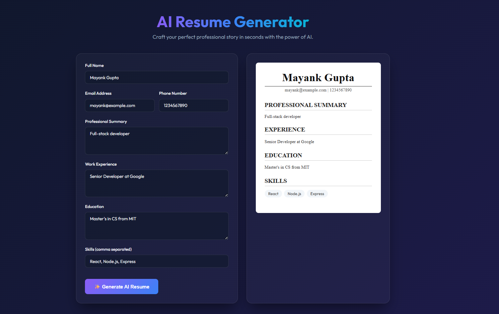

# AI Resume Generator

🚀 **Live Demo**: [https://mayankgupta8448.github.io/resume-generator](https://mayankgupta8448.github.io/resume-generator)

## Project Description

AI-powered web application that helps users generate professional resumes with customizable templates and PDF download functionality.

## GitHub Repository

[https://github.com/mayankgupta8448/resume-generator](https://github.com/mayankgupta8448/resume-generator)

## Tech Stack

- **Frontend**: React, Vite, Vanilla CSS 
  - *Features*: Glassmorphism, smooth gradients, animated loaders, responsive design.
- **Backend**: Node.js, Express, CORS
  - *Features*: RESTful API endpoint for handling resume generation logic.

## Screenshots





## Setup Instructions

### Prerequisites
Make sure you have Node.js and npm installed.

### 1. Backend Setup

Navigate to the backend directory:
```bash
cd resume-ai-backend
```

Install the required dependencies:
```bash
npm install
```

Start the Express API server:
```bash
npm start
# or
node server.js
```
The server will be running on `http://localhost:3001`.

### 2. Frontend Setup

In a new terminal, navigate to the frontend directory from the project root:
```bash
cd resume_frontend
```

Install the dependencies:
```bash
npm install
```

Start the Vite development server:
```bash
npm run dev
```
The client will be running on `http://localhost:5173`. Open your browser to begin generating resumes.
